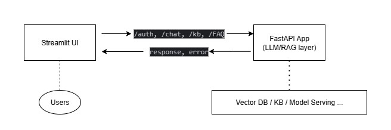
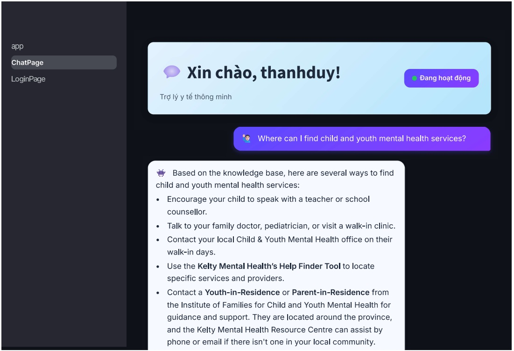

# Viet Care Assistant 🤖

Trợ lý y tế – Streamlit + FastAPI + RAG/LLM

<p align="center">
  <a href="#tính-năng-chính">Tính năng</a> •
  <a href="#kiến-trúc--luồng-xử-lý">Kiến trúc</a> •
  <a href="#cách-chạy">Cách chạy</a> •
  <a href="#cấu-hình">Cấu hình</a> •
  <a href="#api-quick-reference">API Quick Reference</a> •
  <a href="#thư-mục--công-nghệ">Thư mục & Công nghệ</a> •
  <a href="#xử-lý-lỗi">Xử lý lỗi</a> •
  <a href="#liên-hệ">Liên hệ</a> •
</p>

## Tính năng chính

- **Hỏi đáp y tế**: Giao diện trò chuyện đơn giản.
- **Giao diện thân thiện**: Header rõ ràng, bong bóng chat với (user) và (assistant).
- **Quản lý hội thoại**: Lưu lịch sử chat trong session, hỗ trợ xóa lịch sử.
- **Bảo mật cơ bản**: Đăng ký/đăng nhập với JWT.
- **Quản lý kiến thức**: Tạo collection (`/kb_collections`) và upload file FAQ JSON (`/kb_faq`).
- **RAG**: Hỗ trợ RAG cho phản hồi dựa trên knowledge base.

**Lưu ý**: Đây là phiên bản MVP. Nếu gặp lỗi trong chat, xem phần [Xử lý lỗi](#xử-lý-lỗi).

## Kiến trúc & luồng xử lý

<p align="center">
  
  <br>
  <em>Luồng xử lý</em>
</p>


## Cách chạy

### 1) Backend (FastAPI)

```bash
# Tạo virtual environment (khuyến nghị)
python -m venv .venv
source .venv/bin/activate  # macOS/Linux
# hoặc .venv\Scripts\activate  # Windows

# Cài dependencies
pip install fastapi uvicorn sqlalchemy requests  # Thêm các thư viện khác nếu cần

# Chạy server
uvicorn app.app_main:app --host 127.0.0.1 --port 18080
```

### 2) Frontend (Streamlit)

```bash
# Cài dependencies
pip install streamlit requests

# Chạy UI
streamlit run chat_ui.py
```

### 3) Sử dụng

<p align="center">
  
  <br>
  <em>Giao diện Chat</em>
</p>


1. **Đăng ký**: Tạo tài khoản qua tab "Đăng ký" (username, password, role, date_of_birth: YYYY-MM-DD, phone, email).
2. **Đăng nhập**: Dùng username/password để lấy `access_token`.
3. **Tạo Collection**: Tạo knowledge base collection (tên, mô tả, ngôn ngữ: vi/en).
4. **Upload FAQ**: Upload file JSON FAQ vào collection (mặc định `collection_id=5`).
5. **Chat**: Gửi câu hỏi y tế (VD: "Triệu chứng đau đầu là gì?").
6. **Xóa lịch sử**: Nhấn nút "Xóa lịch sử chat" để reset.

## Cấu hình

- **BASE_URL** (frontend): Trong `chat_ui.py`:
  ```python
  BASE_URL = "http://127.0.0.1:18080"
  ```
  Đổi sang domain/port phù hợp khi deploy.

## API Quick Reference

| Endpoint | Method | Body                                                                                                                   | Ghi chú |
|----------|--------|------------------------------------------------------------------------------------------------------------------------|---------|
| `/auth/register` | POST | `{"username": "...", "password": "...", "role": "...", "date_of_birth": "YYYY-MM-DD", "phone": "...", "email": "..."}` | Đăng ký người dùng |
| `/auth/login` | POST | `{"username": "...", "password": "..."}`                                                                               | Trả về `access_token` |
| `/kb_collections/collections/` | POST | `{"name": "...", "description": "...", "language": "vi/en"}`                                                           | Tạo collection |
| `/kb_faq/{collection_id}/faqs/upload` | POST | `multipart/form-data` (file JSON)                                                                                      | Upload FAQ |
| `/chat/{collection_id}/conversations` | POST | `{"userid": "...", "topic": "..."}`                                                                                    | Tạo conversation |
| `/chat/{collection_id}/conversations/{conversation_id}/messages` | POST | `{"role": "user", "content": "..."}`                                                                                   | Gửi tin nhắn, nhận phản hồi LLM |

**Test mặc định**: Sử dụng `/chat/5/conversations/14/messages` với body `{"role": "user", "content": "Xin chào"}`.

## Thư mục & Công nghệ

```
.             
├── app/
│   ├── frontend/
│   │   ├── app.py                 
│   ├── app_main.py
│   ├── router/
│   │   ├── auth.py
│   │   ├── chat.py
│   │   ├── kb_collection.py
│   │   ├── kb_faq.py
│   ├── database.py
│   ├── models/
│   │   ├── user.py
│   │   ├── knowledge_base.py
│   ├── schemas/
│   │   ├── user.py
│   │   ├── conversation.py
│   │   ├── message.py
│   │   ├── kb_collection.py
│   │   ├── kb_faq.py
│   ├── services/
│   │   ├── auth.py
│   │   ├── llm.py
│   │   ├── upload_faq.py
│   ├── config.py
├── requirements.txt       
├── requirements-frontend.txt  
└── README.md
```

## Xử lý lỗi

- **401 Unauthorized**: Nếu `/chat` yêu cầu `Authorization: Bearer <token>`, cập nhật hàm `send_message` trong `chat_ui.py`:
  ```python
  headers = {"Authorization": f"Bearer {st.session_state.user['access_token']}"}
  response = requests.post(MESSAGE_URL, json=data, headers=headers)
  ```
- **404 Not Found**: Kiểm tra `collection_id` và `conversation_id` trong database.
- **500 Internal Server Error**: Kiểm tra log backend (SQLAlchemyError hoặc lỗi RAG trong `llm.py`).


## Góp ý & liên hệ

Nếu thấy hữu ích hoặc cần tính năng mới, hãy mở Issue/PR trên repository. 🙌  
Liên hệ: 
- **Email**: duynvt.work@gmail.com
- **LinkedIn**: www.linkedin.com/in/duynvt0203
